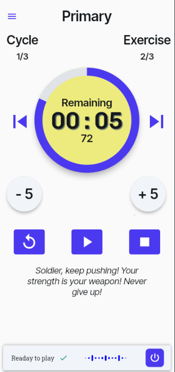
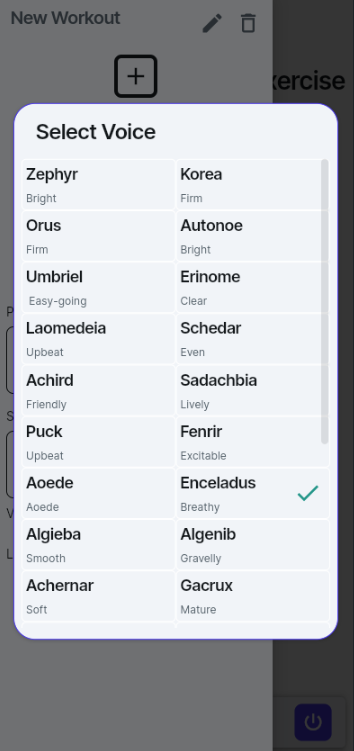

# Kinetic

Kinetic to aplikacja do treningu interwałowego na Androida i iOS, wyposażona w funkcję Trenera AI. Trener motywuje użytkownika do wysiłku w wybranym przez niego stylu, głosie i języku.

## Funkcje

- **Trening interwałowy** – Twórz i zarządzaj własnymi zestawami ćwiczeń.
- **Trener AI** – Motywuje do ćwiczeń, generując teksty motywacyjne w wybranym stylu.
- **Wsparcie Gemini AI** – Generowanie tekstu motywacyjnego oraz mowy (Gemini 2.5 TTS).
- **Personalizacja** – Wybierz styl, głos i język trenera.
- **Działa na Androidzie i iOS**.

## Pobieranie

Aplikację niedługo będzie można pobrać bezpośrednio ze sklepu Google Play lub App Store.

## Zrzuty ekranu

### Widok treningu

### Wybór głosu trenera

